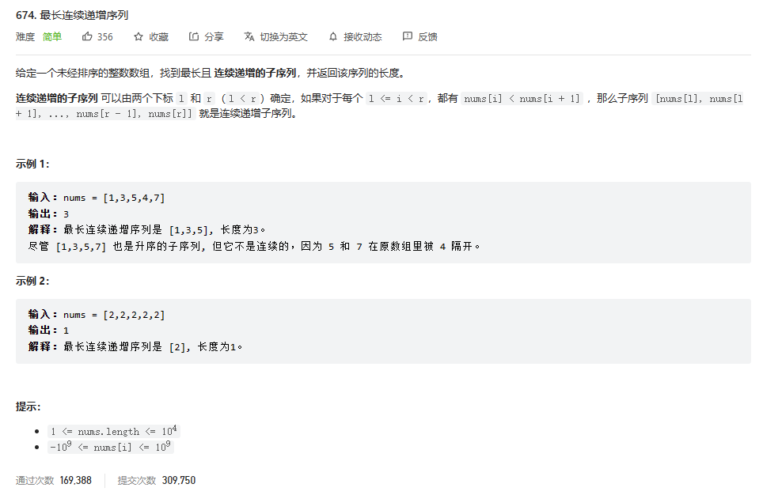
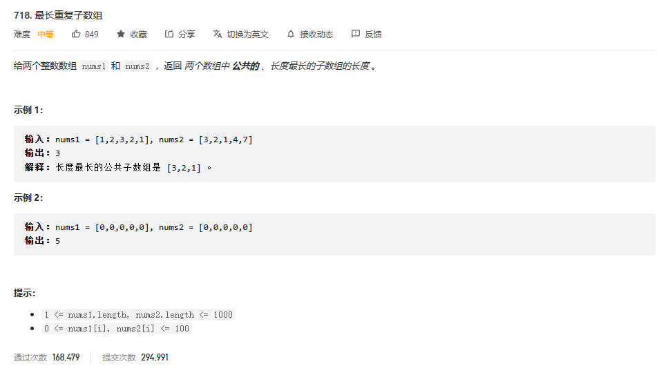
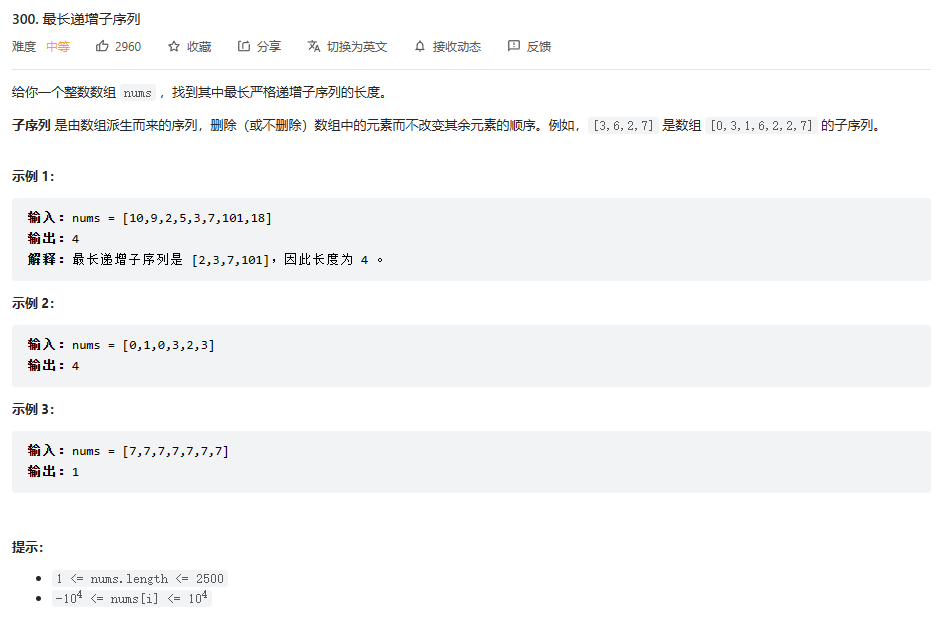
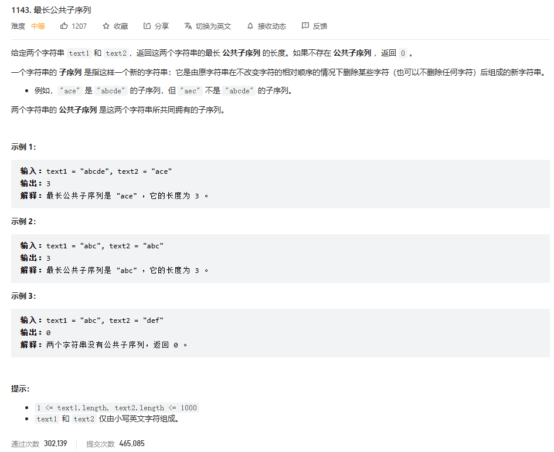
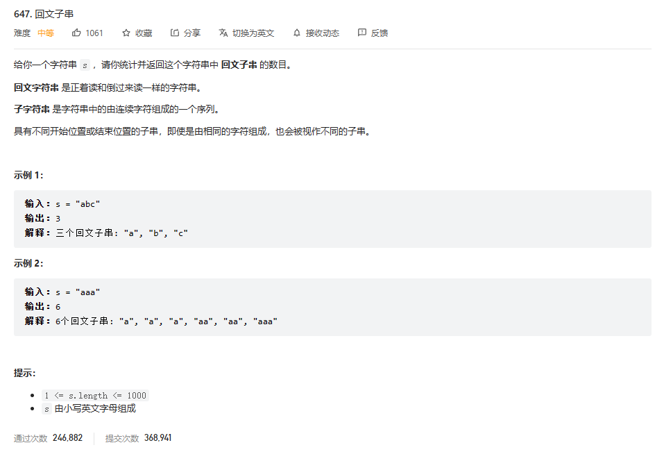
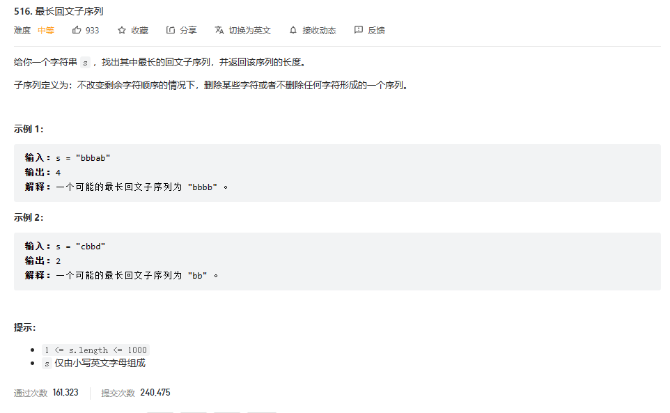

# 1.动态规划中的子序列和子数组的问题（连续和不连续的问题）
### 提示：子数组，表示的是连续的情况，数组必须是连续的；子序列，表示的是可以是不连续的情况；子串，字符串中连续，子序列为不连续的。
### 无论是对于一维的连续问题还是二维的连续问题，都是讨论包含结尾的情况
1. 对于**一维的连续问题**，则只需要考虑以当前i为结尾的最大值（最小最）是多少，**一定要包含当前的i**，例如，题目有**leetcode674**

2. 对于**二维连续情况**，也是一定要包含i和j的情况，然后遍历所有的i和j，例如题目有题目有**leetcode718**

3. 对于有一些**一维子序列**的问题，有时候也需要讨论讨论**包含边界**的情况，因为答案一定在包含某个边界情况当中 例如leetcode300，最长递增子序列

4. 对于**二维子序列的问题**，则一样讨论边界i和j，例如**leetcode1143最长公共子序列问题**i和j都不等于0的情况下三种情况：
   - 一定不包含i但是可能包含j
   - 一定不包含j但是可能包含i
   - 一定包含i和j

5. 对于一些求数量的问题，也要对边界进行讨论（一维的话只有i，二维的话由i和j） **例如leetcode647**，求一个字符串的所有回文子串的数量
这时候这是一个i和j的问题，并且是求**子串，所以说这是一个连续的问题**，这时候就要讨论一定包含i并且一定包含j的情况；
并且遍历所有符合条件的i和j；
在改写动态规划的时候同时应该注意遍历的顺序，遍历的顺序由地推关系可以知道，dp[i][j] = dp[i+1][j-1],表明i所在的那一层遍历应该从后面开始，j所在的那一层遍历应该从0开始

6. **范围尝试模型**：是一个子序列问题，在一个一维数组或者字符串中讨论区间的左边界和右边界的情况。例如**leetcode516**，str[L...R]的最长回文子序列是多少，可能性有：
     - 一定不包含i但是可能包含j 
     - 一定不包含j但是可能包含i 
     - 一定包含i和j

# 2.动态规划中数量的问题
动态规划中求数量的问题，分情况，（1）如果是连续的问题，如lc647求回文串的数量，这时候是要讨论包含边界的情况，然后枚举所有的边界情况。
（2）如果是可以知道决策情况的问题，比如爬楼梯和青蛙跳台阶，他们的在每一台阶只有两种情况，一种是跳一步，另一种是跳两步，只不过在在跳两步收集结果的时候，
需要取判断一下一些条件，比如剩余的台阶数量要大于等于2。同理剑指offer46题也类似。

1. 求数量的问题，也要对边界进行讨论（一维的话只有i，二维的话由i和j） **例如leetcode647**，求一个字符串的所有回文子串的数量
这时候这是一个i和j的问题，并且是求**子串，所以说这是一个连续的问题**，这时候就要讨论一定包含i并且一定包含j的情况；
并且遍历所有符合条件的i和j；
在改写动态规划的时候同时应该注意遍历的顺序，遍历的顺序由地推关系可以知道，dp[i][j] = dp[i+1][j-1],表明i所在的那一层遍历应该从后面开始，j所在的那一层遍历应该从0开始

   1. 青蛙跳台阶类似问题：**爬楼梯、剑指offer46把数字翻译成字符串、机器人走路径问题**等等。这类问题都有一个共性，就是在决策在每一次的决策数量是一定的，
   决策的可能性是已知的，这样就可以利用暴力递归然后改写动态规划，暴力递归的书写很方便。比如爬楼梯和青蛙跳台阶，他们的在每一台阶只有两种情况，一种是跳一步，另一种是跳两步，只不过在在跳两步收集结果的时候，
   需要取判断一下一些条件，比如剩余的台阶数量要大于等于2。 
      - 以**剑指offer46题数字翻译成字符串个数为例**，翻译单词的时候可以选择只翻译一个，也可以选择翻译两个。只有两种情况。
      - **但是要注意的是**：翻译两个单词的情况的时候，要保证现在存在的数字数量大于等于2，并且要保证这两个数字的组合要在10和25之间
         因为两个数字的组合06是不符合条件的，所以要保证在10和25之间。
      