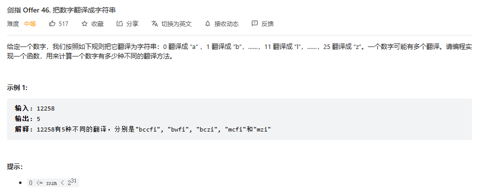
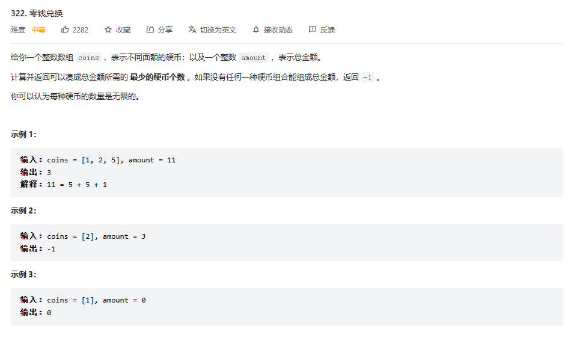

# 1.动态规划中的子序列和子数组的问题（连续和不连续的问题）
### 提示：子数组，表示的是连续的情况，数组必须是连续的；子序列，表示的是可以是不连续的情况；子串，字符串中连续，子序列为不连续的。
### 无论是对于一维的连续问题还是二维的连续问题，都是讨论包含结尾的情况
1. 对于**一维的连续问题**，则只需要考虑以当前i为结尾的最大值（最小最）是多少，**一定要包含当前的i**，例如，题目有**leetcode674**

2. 对于**二维连续情况**，也是一定要包含i和j的情况，然后遍历所有的i和j，例如题目有题目有**leetcode718**

3. 对于有一些**一维子序列**的问题，有时候也需要讨论讨论**包含边界**的情况，因为答案一定在包含某个边界情况当中 例如leetcode300，最长递增子序列

4. 对于**二维子序列的问题**，则一样讨论边界i和j，例如**leetcode1143最长公共子序列问题**i和j都不等于0的情况下三种情况：
   - 一定不包含i但是可能包含j
   - 一定不包含j但是可能包含i
   - 一定包含i和j

5. 对于一些求数量的问题，也要对边界进行讨论（一维的话只有i，二维的话由i和j） **例如leetcode647**，求一个字符串的所有回文子串的数量
这时候这是一个i和j的问题，并且是求**子串，所以说这是一个连续的问题**，这时候就要讨论一定包含i并且一定包含j的情况；
并且遍历所有符合条件的i和j；
在改写动态规划的时候同时应该注意遍历的顺序，遍历的顺序由地推关系可以知道，dp[i][j] = dp[i+1][j-1],表明i所在的那一层遍历应该从后面开始，j所在的那一层遍历应该从0开始

6. **范围尝试模型**：是一个子序列问题，在一个一维数组或者字符串中讨论区间的左边界和右边界的情况。例如**leetcode516**，str[L...R]的最长回文子序列是多少，可能性有：
     - 一定不包含i但是可能包含j 
     - 一定不包含j但是可能包含i 
     - 一定包含i和j

# 2.动态规划中数量的问题(或最值问题)
动态规划中求数量的问题，分情况，（1）如果是连续的问题，如lc647求回文串的数量，这时候是要讨论包含边界的情况，然后枚举所有的边界情况。
（2）如果是可以知道决策情况的问题，比如爬楼梯和青蛙跳台阶，他们的在每一台阶只有两种情况，一种是跳一步，另一种是跳两步，只不过在在跳两步收集结果的时候，
需要取判断一下一些条件，比如剩余的台阶数量要大于等于2。同理剑指offer46题也类似，只是判断的条件不同。

1. 求数量的问题，也要对边界进行讨论（一维的话只有i，二维的话由i和j） **例如leetcode647**，求一个字符串的所有回文子串的数量
这时候这是一个i和j的问题，并且是求**子串，所以说这是一个连续的问题**，这时候就要讨论一定包含i并且一定包含j的情况；
并且遍历所有符合条件的i和j；
在改写动态规划的时候同时应该注意遍历的顺序，遍历的顺序由地推关系可以知道，dp[i][j] = dp[i+1][j-1],表明i所在的那一层遍历应该从后面开始，j所在的那一层遍历应该从0开始

   1. 青蛙跳台阶类似问题：**爬楼梯、剑指offer46把数字翻译成字符串、机器人走路径问题**等等。这类问题都有一个共性，就是在决策在每一次的决策数量是一定的，
   决策的可能性是已知的，这样就可以利用暴力递归然后改写动态规划，暴力递归的书写很方便。比如爬楼梯和青蛙跳台阶，他们的在每一台阶只有两种情况，一种是跳一步，另一种是跳两步，只不过在在跳两步收集结果的时候，
   需要取判断一下一些条件，比如剩余的台阶数量要大于等于2。 
      - 以**剑指offer46题数字翻译成字符串个数为例**，翻译单词的时候可以选择只翻译一个，也可以选择翻译两个。只有两种情况。
      - **但是要注意的是**：翻译两个单词的情况的时候，要保证现在存在的数字数量大于等于2，并且要保证这两个数字的组合要在10和25之间
         因为两个数字的组合06是不符合条件的，所以要保证在两个数字组合在10和25之间。
      
 

# 3.背包问题

1. 01背包问题：对于01背包问题，每次遍历物品的时候只有两种可能，一种是取当前的物品一种是不取当前的物品，取当前的物品的话，
计算该物品的价值，不取当前物品的话直接遍历下一个物品，然后返回当前物品两种决策行为利润最大值的那一个。base case，遍历完所有
物品，还有就是背包的容量小于0，背包的容量可能可以等于0，因为有一些问题中物品所占的空间为0。

**01背包问题的变形：** 
leetcode416分割等和子集：https://leetcode.cn/problems/partition-equal-subset-sum/

leetcode494目标和：https://leetcode.cn/problems/target-sum/

leetcode一和零：https://leetcode.cn/problems/ones-and-zeroes/

leetcode1049最后一块石头的重量：https://leetcode.cn/problems/last-stone-weight-ii/

2. 完全背包问题：完全背包问题和01背包问题的区别在于，完全背包问题的物品可以多次重复的获取。

**例子leetcode518零钱兑换II**：https://leetcode.cn/problems/coin-change-ii/

**例子leetcode279完全平方数**：https://leetcode.cn/problems/perfect-squares/

**例子leetcode322零钱兑换**：https://leetcode.cn/problems/coin-change/

**例子leetcod139单词拆分**：https://leetcode.cn/problems/word-break/

3. 买卖股票问题

买卖股票问题，重点分析买卖股票的状态。可以大致将买卖股票的状态分为两大类，第一类是持有股票能获得的最大收益，
持有股票分为当前不买入股票，维持上一天的持有状态，当天买入股票，然后取两种情况的最大值；
第二类是不持有股票能获得的最大收益，同样有两种情况，当前维持上一天的不持有的状态，第二种情况是当天卖出，然后取两者的最大值。
最后返回最后一天不持有股票的最大收益，即是买卖股票的最大收益。

（1）买卖股票的最佳时机 leetcode121：https://leetcode.cn/problems/best-time-to-buy-and-sell-stock/

考虑两种状态是
1）第一类是持有股票能获得的最大收益，
持有股票分为当前不买入股票，维持上一天的持有状态，当天买入股票，然后取两种情况的最大值；
2）第二类是不持有股票能获得的最大收益，同样有两种情况，当前维持上一天的不持有的状态，第二种情况是当天卖出，然后取两者的最大值。
最后返回最后一天不持有股票的最大收益，即是买卖股票的最大收益。

**本题需要注意的时候**，只能进行**一次**的买卖，所在在持有的状态的时候可以保持持有昨天的，也可以买入，**特别注意**
买入的时候，由于只是一次的买卖，所以在买之前是没有任何可能存在卖的，所以买入的收益为-prices[i]而不是dp[i-1][1]-prices[i]。

（2）买卖股票的最佳时期II leetcode122：https://leetcode.cn/problems/best-time-to-buy-and-sell-stock-ii/

和上一题类似的，但是本题中允许进行多次交易，所以在买入的时候的收益是dp[i-1][1]-prices[i]，前一天不持有股票的最大收减去当前买入股票。

（3）买卖股票的最佳时期III leetode123:https://leetcode.cn/problems/best-time-to-buy-and-sell-stock-iii/

这里是直接限定了只能进行两次买卖
在第一次买入的时候，因为再第一次买入的时候没有卖出操作，所以只能是-price[i] 而不能是dp[i-1][1]-price[i]
其余的操作和上面两题一样

